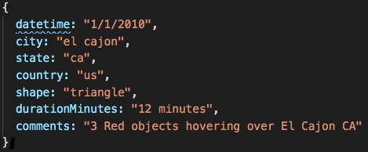
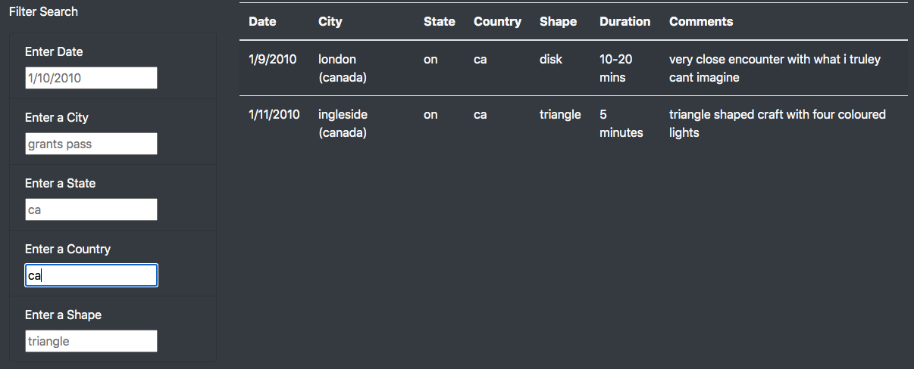
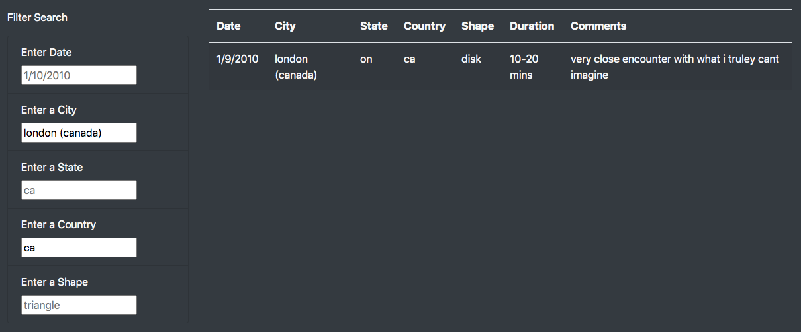
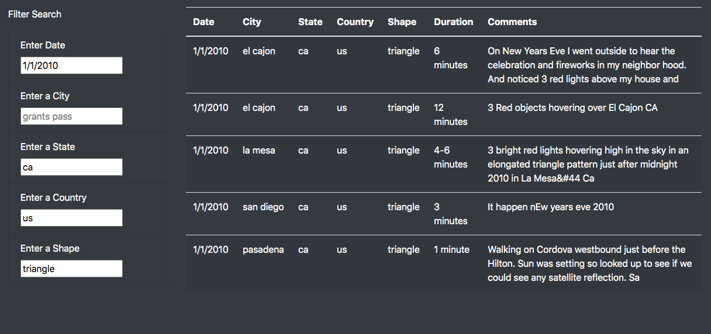

# **UFOs**  

## **Overview of Project**
In this project we are creating an interactive web page to show the information on UFO sightings 

### **Purpose**

Our source data for this project ([UFO sightings data](static/js/data.js)) contains more than 100 records of UFO sightings in different places in north America. One of the records in this file is shown in [Fig. 1](screenshots/data_sample.png).

|*Fig. 1: a sample of the source file*|
:--:
||

&nbsp;

Using the provided data we created a webpage to show the records with some options to filter the data for specific sightings based on the criteria introduced by the user.
&nbsp;

## **Results**  

In this project we used HTML and JavaScript to create an interactive webpage to present the information in a table and enable the users to filter the data in that table based on the date, city, state, country and the shape of the observed object.  
first we used the javascript to load all the data into the table once the page is opened.The initial look of the webpage is shown in [Fig. 2](screenshots/wp_nofilter.png):

|*Fig. 2: Initital look of the web page (not filtered data)*|
:--:
||

&nbsp;

then we wrote a code in javascript to search and filter the data based on the values entered by the user in the search boxes (on the left of the table in Fig. 2) and recreate the table to show the desired information. It can bee seen in Fig. 2, that there are examples of the type and format of the data each filter box accepts as input. users can filter the data by simply enter their desired option in the filter boxes and press enter or click somewhere else on the page, as soon as the value in the filter box changes the data corresponding to that criteria will be shown in the table. these filters can be used individually or in the combination with one another. 
Figures 3-5 are the examples of the filtered data. [Fig. 3](screenshots/3.png), shows the data filtered for  the sightings in Canada, in [Fig. 4](screenshots/4.png) we can see  the filtered data for the UFO sightings in the city of London in Canada and [Fig. 5](screenshots/5.png), shows the sightings on 1/1/2010 in california state in USA and in the shape of a triangle.

|*Fig. 3: filtered sightings based on only the country(Canada)*|
:--:
||

&nbsp;

|*Fig. 4: filtered sightings based on the country (Canada) and city (London)*|
:--:
||

&nbsp;

|*Fig. 5: filtered sightings based on the country (US), state (CA), date (1/1/2010) and shape (Triangle)*|
:--:
||

&nbsp;

In order to clear the filters, user can refreh the page, click on the "UFO Sithings" link at the top left corner of the page or delete the values in the filter boxes manually.

## **summary**  

- There is a drawback to the design of this web page. Most possibly users do not know about all the available data and hence, they are not aware of their options to filter the data. In that case it will be a little hard for them to use the filters, because for example the don't know what options they have for filtering the city or the date of the sighting. they have to review all the data in the unfiltered table to find their options and that would be a burdensome and confusing process.
- To address the above issue we can add a drop-down menu to the filter boxes with the available data for each category so that users can select an option from that menu and filter the table.
- Additionally we can add an "Apply Filter" button to the page. With that, users would be able to select or input all the filters they want and apply them at once instead of applying them one after another. We can also have a "Clear Filter" button to remove all the filter an show the original data again, without that users have to clear each filter manually or refresh the page.
- We can make it even more efficient by embedding the filter boxes in the table itself. A drop-down menu can be placed under each column's name in the table, containing the available options for filtering the data and users can filter the data by selecting and option.
